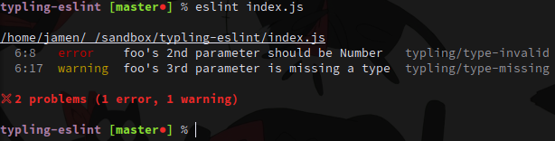

# eslint-plugin-typling

> Typling plugin for Eslint



## Installation

```sh
$ npm install --save eslint-plugin-typling
```

## Usage

Load it in your `"plugins"` array:

```js
"plugins": ["typling" /*, "react", "promise", ... */]
```

Configure the rules

```js
"rules": {
  // 1 for warnings, 2 for errors:
  "typling/type-invalid": 2,
  "typling/type-missing": 1,
  "typling/def-missing": 1
}
```

And you're done

## License

MIT © [Jamen Marz](https://git.io/jamen)

---

[][package] [](https://travis-ci.org/jamen/eslint-plugin-typling) [][package] [][package]  [](https://github.com/jamen)

[package]: https://npmjs.org/package/eslint-plugin-typling
